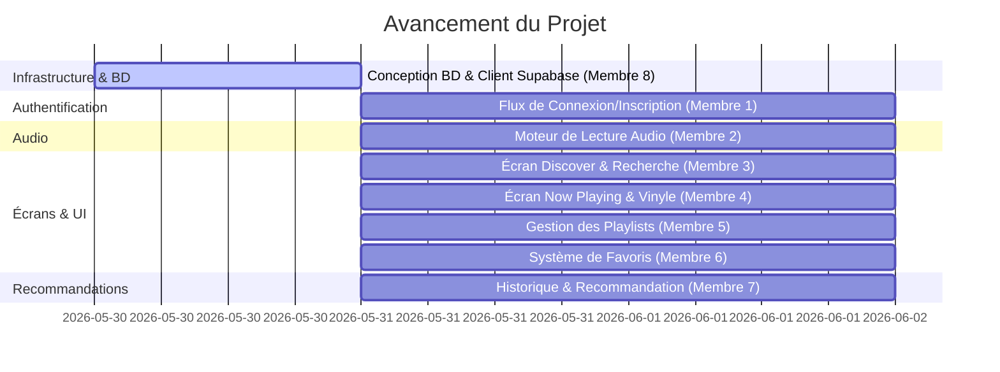

# Répartition des Tâches & Guide d'Intégration (React Native + Supabase)

Ce document présente la répartition des rôles pour les **8 membres** du groupe ainsi que le guide technique d'utilisation des services de données créés par le **Membre 8** (votre infrastructure API et base de données).

---

## 👥 Rôles et Avancement des Membres



---

## 🟢 Tâches Réalisées par le Membre 8 (Validé ✅)

L'infrastructure et le socle de connexion ont été entièrement mis en place pour le projet. Voici le détail des fichiers créés :

1. **Base de Données Relationnelle** : [supabase_schema.sql](file:///home/skjuve/Vidéos/spotifyapp/supabase_schema.sql)
   * Schéma SQL complet : profils, artistes, albums, morceaux, playlists, favoris, historique.
   * Déclencheurs (triggers) automatiques pour la création de profils et la mise à jour des statistiques de likes/lectures.
   * RLS (Row Level Security) activé avec politiques d'accès sécurisées par utilisateur.
2. **Configuration du Client** : [supabaseClient.ts](file:///home/skjuve/Vidéos/spotifyapp/src/services/supabaseClient.ts)
   * Connexion automatique avec `@supabase/supabase-js`.
   * Intégration de `@react-native-async-storage/async-storage` pour garder l'utilisateur connecté d'une session à l'autre.
3. **Modèles de Données Typés** : [types/index.ts](file:///home/skjuve/Vidéos/spotifyapp/src/types/index.ts)
   * Interfaces TypeScript complètes pour tous les modèles.
4. **Service d'Authentification** : [authService.ts](file:///home/skjuve/Vidéos/spotifyapp/src/services/authService.ts)
   * Méthodes d'inscription, connexion, déconnexion et de récupération du profil.
5. **Service de Musique** : [musicService.ts](file:///home/skjuve/Vidéos/spotifyapp/src/services/musicService.ts)
   * API d'accès aux morceaux, recherche, gestion de playlists, favoris et historique d'écoutes.
6. **Passerelle d'Environnement** : [env.ts](file:///home/skjuve/Vidéos/spotifyapp/src/config/env.ts)
   * Fichier centralisé pour configurer l'URL Supabase et la clé anonyme publique du groupe.
7. **Jeu d'Essai (Données de test)** : [seed_data.sql](file:///home/skjuve/Vidéos/spotifyapp/seed_data.sql)
   * Données d'initialisation SQL avec des morceaux et fichiers audio MP3 jouables publiquement.

---

## 🛠️ Guide d'Installation de l'Environnement (Pour tout le groupe)

1. **Configurer les clés de projet** :
   * Copiez le fichier `.env.example` en le renommant `.env` à la racine du projet.
   * Ouvrez le fichier [env.ts](file:///home/skjuve/Vidéos/spotifyapp/src/config/env.ts) et remplacez les valeurs de `SUPABASE_URL` et `SUPABASE_ANON_KEY` par vos identifiants du dashboard Supabase.
2. **Initialiser la base de données** :
   * Ouvrez l'éditeur SQL dans votre console Supabase.
   * Copiez-collez et exécutez d'abord le contenu de [supabase_schema.sql](file:///home/skjuve/Vidéos/spotifyapp/supabase_schema.sql) pour créer les tables et triggers.
   * Exécutez ensuite le contenu de [seed_data.sql](file:///home/skjuve/Vidéos/spotifyapp/seed_data.sql) pour insérer les artistes, albums et pistes d'exemple.

---

## 📖 Guide de Code : Utilisation des Services pour chaque Tâche

Voici comment chaque membre doit exploiter les fichiers créés par le **Membre 8** pour sa tâche.

### 🔴 Membre 1 - Authentification (UI et logique de session)
Vous devez utiliser `authService` de [authService.ts](file:///home/skjuve/Vidéos/spotifyapp/src/services/authService.ts) pour vos formulaires.

* **Exemple d'Inscription (Sign Up)** :
  ```typescript
  import { authService } from '../services/authService';

  // Dans votre formulaire d'inscription
  const handleSignUp = async () => {
    try {
      await authService.signUp(email, password, username, avatarUrl);
      alert("Compte créé avec succès ! Un e-mail de confirmation vous a été envoyé.");
    } catch (error: any) {
      alert("Erreur d'inscription : " + error.message);
    }
  };
  ```

* **Exemple de Connexion (Sign In)** :
  ```typescript
  const handleLogin = async () => {
    try {
      await authService.signIn(email, password);
      // L'utilisateur est connecté et sa session est automatiquement enregistrée
    } catch (error: any) {
      alert("Erreur de connexion : " + error.message);
    }
  };
  ```

* **Détecter si l'utilisateur est connecté au démarrage de l'app ([App.tsx](file:///home/skjuve/Vidéos/spotifyapp/App.tsx))** :
  ```typescript
  import { useEffect, useState } from 'react';
  import { authService } from './src/services/authService';

  // Dans votre composant principal App
  useEffect(() => {
    // 1. Vérifier si une session existe déjà
    authService.getCurrentProfile().then(profile => {
      if (profile) {
        console.log("Connecté en tant que :", profile.username);
      }
    });

    // 2. Écouter les changements d'état (connexion/déconnexion en cours d'utilisation)
    const subscription = authService.onAuthStateChange((event, session) => {
      if (event === 'SIGNED_IN' && session) {
        // Rediriger vers l'écran Discover
      } else if (event === 'SIGNED_OUT') {
        // Rediriger vers l'écran Login
      }
    });

    return () => {
      subscription.unsubscribe();
    };
  }, []);
  ```

---

### 🔴 Membre 2 & Membre 4 - Moteur de Lecture & Écran Now Playing
Vous devez connecter la liste des chansons récupérées à votre lecteur audio, puis envoyer les statistiques d'écoute en base.

* **Récupérer la source audio d'un morceau** :
  Le type [Song](file:///home/skjuve/Vidéos/spotifyapp/src/types/index.ts) possède un attribut `audio_url` qui est un lien direct vers le fichier audio hébergé (ex: MP3). Renseignez ce lien dans votre lecteur audio (`react-native-track-player` ou `expo-av`).

* **Enregistrer une écoute (Historique)** :
  Une fois qu'un morceau a été joué pendant plus de 30 secondes ou s'est terminé, appelez la méthode `logPlayHistory` du [musicService.ts](file:///home/skjuve/Vidéos/spotifyapp/src/services/musicService.ts) :
  ```typescript
  import { musicService } from '../services/musicService';

  const onSongFinished = async (songId: string, durationSec: number) => {
    // Cette fonction insère une ligne dans 'play_history'.
    // Le déclencheur côté Supabase incrémentera automatiquement le 'play_count' de la chanson.
    await musicService.logPlayHistory(songId, durationSec);
  };
  ```

---

### 🔴 Membre 3 - Écran Discover & Recherche
Vous devez dynamiser le flux d'accueil et faire fonctionner la barre de recherche textuelle.

* **Charger les titres de la semaine et albums en rotation au démarrage** :
  ```typescript
  import { useEffect, useState } from 'react';
  import { musicService } from '../services/musicService';
  import type { Song } from '../types';

  const [songs, setSongs] = useState<Song[]>([]);

  useEffect(() => {
    musicService.getSongs(10).then(data => setSongs(data));
  }, []);
  ```

* **Implémenter la recherche (Fuzzy Search)** :
  Dans votre barre de recherche, ajoutez un écouteur sur le texte saisi :
  ```typescript
  const handleSearch = async (text: string) => {
    if (text.length > 2) {
      const results = await musicService.searchSongs(text);
      // Mettre à jour l'état de l'affichage avec les résultats
    }
  };
  ```

---

### 🔴 Membre 5 - Gestion des Playlists (Listes de lecture)
Vous devez utiliser les fonctions CRUD de [musicService.ts](file:///home/skjuve/Vidéos/spotifyapp/src/services/musicService.ts) liées à la table `playlists`.

* **Créer une nouvelle playlist** :
  ```typescript
  import { musicService } from '../services/musicService';

  const handleCreatePlaylist = async () => {
    const newPlaylist = await musicService.createPlaylist("Ma Playlist Synthwave", false);
    console.log("Playlist créée avec l'ID :", newPlaylist.id);
  };
  ```

* **Ajouter un morceau à une playlist** :
  ```typescript
  const addSong = async (playlistId: string, songId: string, index: number) => {
    await musicService.addSongToPlaylist(playlistId, songId, index);
    alert("Chanson ajoutée à la playlist !");
  };
  ```

* **Récupérer le contenu d'une playlist** :
  ```typescript
  const loadPlaylistSongs = async (playlistId: string) => {
    const songs = await musicService.getPlaylistSongs(playlistId);
    // Afficher la liste des morceaux
  };
  ```

---

### 🔴 Membre 6 - Gestion des Favoris (Likes)
La base de données gère automatiquement les compteurs globaux de likes de chaque chanson ou album grâce aux déclencheurs de base de données. Vous devez simplement associer l'état d'affichage du cœur au clic utilisateur.

* **Liker ou Disliker un titre** :
  ```typescript
  import { musicService } from '../services/musicService';

  const handleLikeToggle = async (songId: string, isCurrentlyLiked: boolean) => {
    // true pour liker, false pour retirer le like
    await musicService.toggleFavoriteSong(songId, !isCurrentlyLiked);
  };
  ```

* **Afficher la bibliothèque de titres aimés par l'utilisateur** :
  ```typescript
  const loadLikedSongs = async () => {
    const favoriteSongs = await musicService.getFavoriteSongs();
    // Charger cette liste dans l'onglet Bibliothèque (Library)
  };
  ```

---

### 🔴 Membre 7 - Algorithme de Recommandation & Historique
Vous devez analyser l'historique de lecture de l'utilisateur pour formuler des propositions intelligentes.

* **Principe de l'algorithme** :
  1. Récuperez les morceaux écoutés récemment dans la table `play_history` ou les favoris de l'utilisateur.
  2. Identifiez les genres (`genre_id`) ou les artistes (`artist_id`) les plus fréquents dans ce panel.
  3. Faites une requête sur la table `songs` filtrée par ces genres et triée par `play_count` décroissant pour recommander les morceaux les plus populaires de ces styles.
